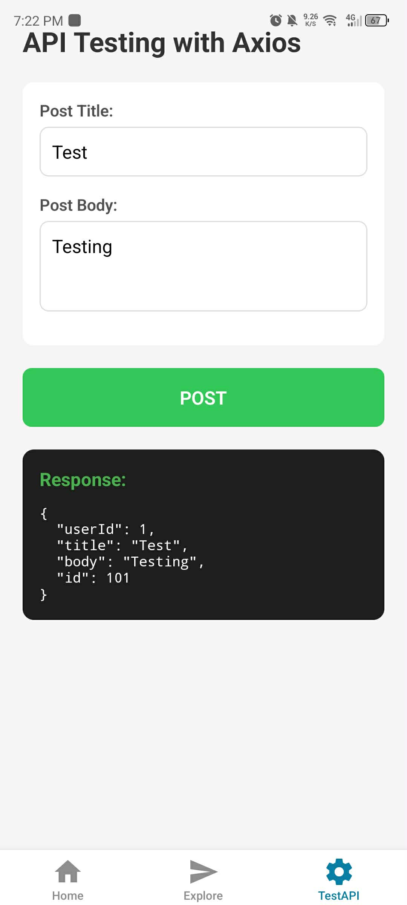

# Milestone 10: Building Interactive & Performant Apps

## Issue 22: Handling API Calls in React Native using Axios & Axios-Retry

While `fetch` is built-in, **Axios** provides several quality-of-life features that are critical for large apps:
* **Automatic JSON Transformation**: You don't need to call `.json()` on every response
* **Interceptors**: You can easily add auth tokens to every request or handle errors globally.
* **Timeouts**: Axios has a built-in `timeout` property, whereas `fetch` requires complex `AbortController` logic just to stop a hanging request.
* **Error Handling**: Axios rejects the promise for any status code outside the 2xx range, while `fetch` only rejects on network failures.

Axios-Retry improve network reliability by preventing temporary "blips" in connectivity from ruining the user experience. By using **Exponential Backoff**, it avoids "spamming" a struggling server. Instead of showing an error screen immediately, the app silently tries again in the background. If the user just walked through a Wi-Fi dead spot, the second or third retry will likely succeed without them ever noticing a problem.

Handling API failures involves three layers: 
1. **Visual Feedback**: Use an ActivityIndicator (spinner) during the request.
2. **User-Friendly Messages**: If all retries fail, show a clear message (e.g., "Check your internet connection") instead of a raw code like Error 500.
3. **Offline Support**: For a productivity app like Focus Bear, I would implement Response Caching (using AsyncStorage or React Query). This allows the user to see their previously loaded data even if the network is currently down.

## Code Snippet on React Native Components

[api.ts]()

[userService.ts]()

[cacheService.ts]()

[apiTest.tsx]()

### Output of Navigation:

