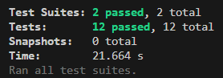

## Milestone 10: Building Interactive & Performant Apps

## Issue 23: Writing Unit and Integration Tests for React Native

Mobile apps run on thousands of different device configurations (screen sizes, OS versions, hardware speeds). Testing ensures that the core logic of the app remains stable regardless of the environment. It also allows developers to **refactor code with confidence**, knowing that if they break a feature, the tests will fail immediately before the code ever reaches a user's phone.

I use `jest.mock('axios')` or specialized libraries like **MSW (Mock Service Worker)**. This replaces the real networking module with a "fake" version that returns hardcoded data instantly. This makes tests deterministic (they produce the same result every time) and incredibly fast.

A **Unit Test** checks a small, isolated piece of code (like a single math function or a simple styled button). An **Integration Test** checks how several units work together—for example, a form component that takes user input, validates it using a helper function, and then dispatches an action to a Redux store.

## Code Snippet on React Native Components

[Counter.tsx](https://github.com/pioloebarle/pioloebarle-intern-repo/blob/main/milestones/8-React-Native-Fundamentals/react-native-project/components/Counter.tsx)

[UserList.tsx](https://github.com/pioloebarle/pioloebarle-intern-repo/blob/main/milestones/8-React-Native-Fundamentals/react-native-project/components/UserList.tsx)

[Counter.test.tsx](https://github.com/pioloebarle/pioloebarle-intern-repo/blob/main/milestones/8-React-Native-Fundamentals/react-native-project/components/__tests__/Counter.test.tsx)

[UserList.test.tsx](https://github.com/pioloebarle/pioloebarle-intern-repo/blob/main/milestones/8-React-Native-Fundamentals/react-native-project/components/__tests__/UserList.test.tsx)

### Output for Unit Testing and Integration Testing

