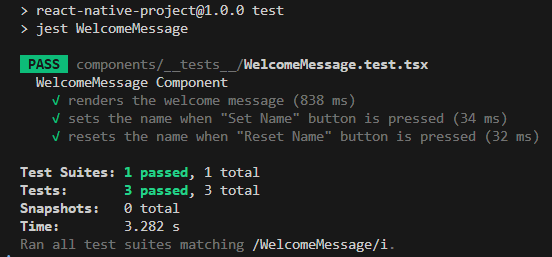

## Milestone 10: Building Interactive & Performant Apps

## Issue 69: Introduction to Unit Testing with Jest

Automated testing acts as a safety net. As an app like Focus Bear grows, developers constantly add new features or refactor old code. Without tests, a change in a small utility function might accidentally break the entire Login or Payment flow. Automated tests catch these "regressions" immediately, allowing you to ship code with confidence and saving hours of manual QA.

When writing my first Jest test, I found that the most significant challenge was shifting my perspective to think in terms of "edge cases"; while testing a simple `1 + 1` addition was straightforward, it was much harder to anticipate and account for what might happen if an input was `null`, `undefined`, or an unexpected string.

I also struggled with the initial environment setup, specifically getting the `ESM` and `CommonJS` imports and exports to play nicely between my main application and the test runner.

Finally, adopting a "testing mindset" proved difficult, as I had to learn how to restructure my logic into pure functions without side effects to ensure my code was actually testable.

## Code Snippet on React Native Components

[AdditionCalculator.tsx](https://github.com/pioloebarle/pioloebarle-intern-repo/blob/main/milestones/8-React-Native-Fundamentals/react-native-project/components/AdditionCalculator.tsx)

[AdditionCalculator.test.tsx](https://github.com/pioloebarle/pioloebarle-intern-repo/blob/main/milestones/8-React-Native-Fundamentals/react-native-project/components/__tests__/AdditionCalculator.test.tsx)

### Output for Unit Testing and Integration Testing:


## Issue 70: Testing React Components with Jest & React Testing Library

Using React Testing Library (RTL) is beneficial because it focuses on user-centric testing. If I test implementation details (like the name of a state variable or a private function), my tests will break every time I refactor my code, even if the UI still looks the same to the user. RTL forces me to find elements by their labels, roles, or text—just like a user or a screen reader would—which makes my tests more robust and ensures the app is actually accessible.

One of the main challenges I faced was ensuring the component state correctly transitioned between multiple interactions within a single test. For instance, in my "Reset Name" test, I had to sequentially simulate pressing the "Set Name" button to change the greeting to "Welcome, Piolo Pascual E. Besinga!" and then immediately trigger the "Reset Name" button to verify it returned to "Welcome, Guest!".

I also found it tricky at first to use the correct queries from `screen`; I had to be very precise with the string matching for my full name to ensure `getByText` wouldn't fail due to a typo. Additionally, using `fireEvent.press` required me to first successfully capture the correct button reference, which taught me the importance of having clear, unique text labels in my UI so the test library can find them easily.

## Code Snippet on React Native Components

**WelcomeMessage.tsx**

```TypeScript
import { useState } from "react";
import { StyleSheet, Text, TouchableOpacity, View } from "react-native";

export default function WelcomeMessage() {
  const [name, setName] = useState(false);
  const fullName = "Piolo Pascual E. Besinga";

  return (
    <View>
      <Text style={styles.message}>
        Welcome, {name ? ` ${fullName}!` : "Guest!"}
      </Text>
      <View style={styles.buttons}>
        <TouchableOpacity
          onPress={() => setName(true)}
          style={styles.buttonStyle}
        >
          <Text>Set Name</Text>
        </TouchableOpacity>
        <TouchableOpacity
          onPress={() => setName(false)}
          style={styles.buttonStyle}
        >
          <Text>Reset Name</Text>
        </TouchableOpacity>
      </View>
    </View>
  );
}

const styles = StyleSheet.create({
  message: {
    fontSize: 18,
    fontWeight: "bold",
    textAlign: "center",
  },
  buttons: {
    flexDirection: "row",
    gap: 10,
    marginTop: 20,
    justifyContent: "center",
  },
  buttonStyle: {
    padding: 10,
    borderRadius: 10,
    borderWidth: 1,
  },
});
```

**WelcomeMessage.test.tsx**

```TypeScript
import { fireEvent, render, screen } from "@testing-library/react-native";
import React from "react";
import WelcomeMessage from "../WelcomeMessage";

describe("WelcomeMessage Component", () => {
  it("renders the welcome message", () => {
    render(<WelcomeMessage />);

    expect(screen.getByText("Welcome, Guest!")).toBeTruthy();
    expect(screen.getByText("Set Name")).toBeTruthy();
    expect(screen.getByText("Reset Name")).toBeTruthy();
  });

  it('sets the name when "Set Name" button is pressed', () => {
    render(<WelcomeMessage />);
    const setNameButton = screen.getByText("Set Name");

    fireEvent.press(setNameButton);

    expect(screen.getByText("Welcome, Piolo Pascual E. Besinga!")).toBeTruthy();
  });

  it('resets the name when "Reset Name" button is pressed', () => {
    render(<WelcomeMessage />);

    const setNameButton = screen.getByText("Set Name");
    const resetNameButton = screen.getByText("Reset Name");

    fireEvent.press(setNameButton);
    expect(screen.getByText("Welcome, Piolo Pascual E. Besinga!")).toBeTruthy();

    fireEvent.press(resetNameButton);
    expect(screen.getByText("Welcome, Guest!")).toBeTruthy();
  });
});
```

### Output for Unit Testing and Integration Testing:

