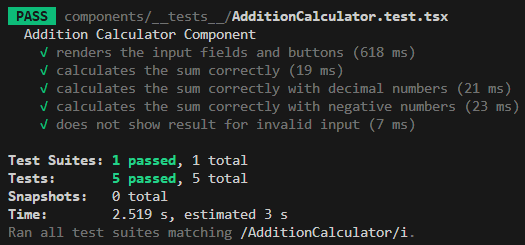

## Milestone 10: Building Interactive & Performant Apps

## Issue 69: Introduction to Unit Testing with Jest

Automated testing acts as a safety net. As an app like Focus Bear grows, developers constantly add new features or refactor old code. Without tests, a change in a small utility function might accidentally break the entire Login or Payment flow. Automated tests catch these "regressions" immediately, allowing you to ship code with confidence and saving hours of manual QA.

When writing my first Jest test, I found that the most significant challenge was shifting my perspective to think in terms of "edge cases"; while testing a simple `1 + 1` addition was straightforward, it was much harder to anticipate and account for what might happen if an input was `null`, `undefined`, or an unexpected string.

I also struggled with the initial environment setup, specifically getting the `ESM` and `CommonJS` imports and exports to play nicely between my main application and the test runner.

Finally, adopting a "testing mindset" proved difficult, as I had to learn how to restructure my logic into pure functions without side effects to ensure my code was actually testable.

## Code Snippet on React Native Components

[AdditionCalculator.tsx](https://github.com/pioloebarle/pioloebarle-intern-repo/blob/main/milestones/8-React-Native-Fundamentals/react-native-project/components/AdditionCalculator.tsx)

[AdditionCalculator.test.tsx](https://github.com/pioloebarle/pioloebarle-intern-repo/blob/main/milestones/8-React-Native-Fundamentals/react-native-project/components/__tests__/AdditionCalculator.test.tsx)

### Output for Unit Testing and Integration Testing:

