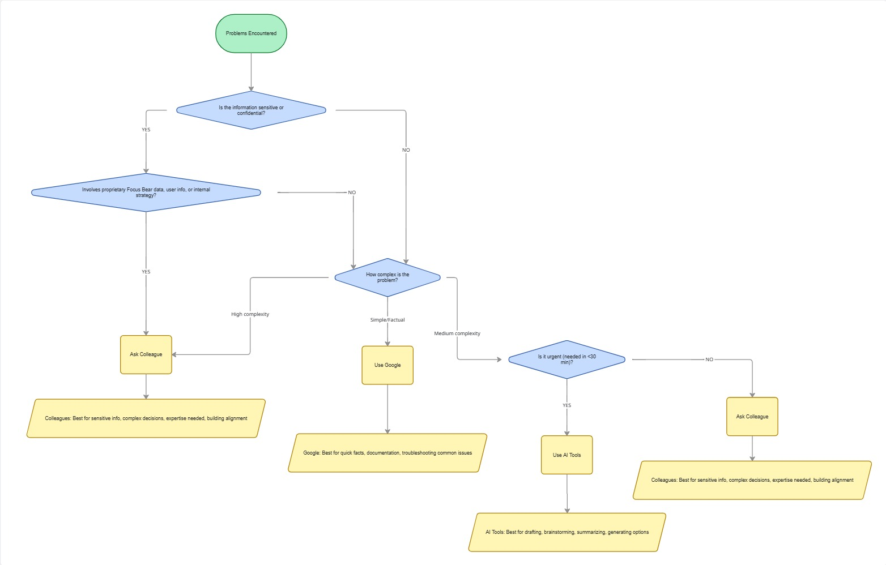

# Milestone 11: Debugging

## Issue 58: When you get stuck - what next?

I prefer **AI** when I have a specific piece of code that isn't working as expected. It can quickly analyze the code, identify potential issues, and suggest fixes. For example, if I encounter a syntax error or a logic bug, I can paste the relevant code snippet into an AI tool to get immediate feedback and solutions. I prefer **Google** when I need to understand a concept more deeply or find documentation. For instance, if I'm unsure about how a particular React Native API works, I can search for official documentation, tutorials, or community discussions to get a comprehensive understanding. Both tools are essential in my debugging process, with AI providing quick fixes and Google offering in-depth knowledge and context.

I ask a colleague when the problem is tied to "institutional knowledge". For example, if I'm working on a feature that interacts with a legacy codebase or a specific internal API, a colleague who has experience with that code can provide insights that aren't documented. They can explain the rationale behind certain design decisions, point out common pitfalls, and share best practices that they've learned through experience. I also reach out if I've reached the end of my 15-minute self-debugging limit and need a fresh perspective to break through a particularly stubborn issue.

The biggest challenge is **"Tunnel Vision"**. When I'm deeply focused on a problem, I can become fixated on a specific solution or approach, which can blind me to alternative explanations or fixes. This can lead to spending a lot of time trying to solve the wrong problem. To overcome this, I set a timer for 15 minutes when I start debugging. If I haven't found a solution by then, I take a step back, clear my mind, and try to look at the problem from a different angle. This might involve changing my environment (like going for a walk), discussing the issue with a colleague, or even just taking a break before returning with fresh eyes. Troubleshooting alone also carries the risk of "Rabbit Holing"—where you try to fix one small error and end up changing ten unrelated things, making the original problem even harder to find.

### Decision-Making Framework for Debugging

