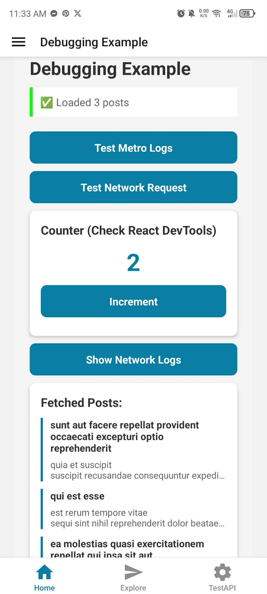
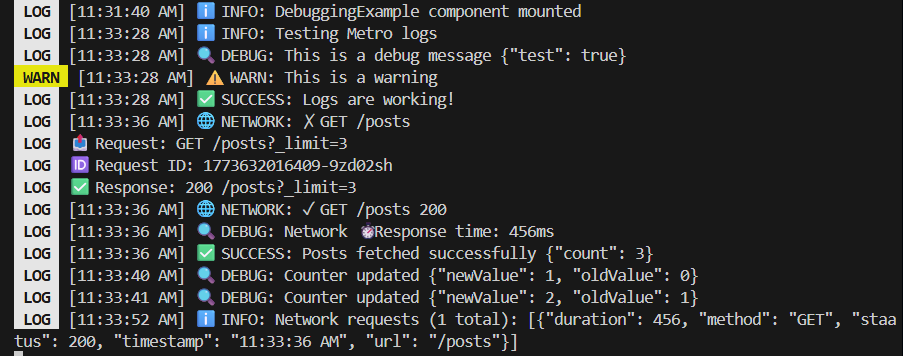

# Milestone 11: Debugging

## Issue 25: Debugging React Native Apps (Flipper, Metro, and Console Logs)

Metro acts as the central hub for the development process. It provides real-time feedback by displaying JavaScript errors and console logs directly in the terminal. More importantly, it manages **Fast Refresh**, which allows me to see the effects of my code changes instantly. If a syntax error occurs, Metro provides a clear stack trace that points to the exact file and line number that caused the crash.

Flipper is a powerful, extensible platform that offers a wide range of native-level debugging tools. Its key features include:
* **Network Inspector**: To view all API traffic.
* **Layout Inspector**: To see the native view hierarchy (beyond just the React components).
* **Database Browser**: To inspect local storage like SQLite or Realm.
* **Logs**: A unified view of both JavaScript logs and Native system logs (Logcat/Device Logs).
* **Plugin Support**: You can add plugins for Redux, React Navigation, and even custom "Worklets" for Reanimated.

The most reliable way is using **Flipper's Network Plugin**, which captures traffic without interfering with the app's logic. Alternatively, I can use **React Native Debugger** or the Network tab in Chrome DevTools if I've enabled remote debugging. For a quick and dirty check, I can also use a "Logger Interceptor" in my Axios configuration to print every request and response directly to the Metro console logs. While Flipper provides a GUI, I successfully utilized Metro-integrated logging to monitor network requests. This allowed me to track API request IDs, response statuses (200 OK), and latency (456ms) directly within the terminal, ensuring that data fetching logic in the Focus Bear app remains efficient without needing external heavy debugging software.

## Code Snippet on Debugging

[DebugPanel.tsx](https://github.com/pioloebarle/pioloebarle-intern-repo/blob/main/milestones/8-React-Native-Fundamentals/react-native-project/components/DebugPanel.tsx)

[DebuggingExample.tsx](https://github.com/pioloebarle/pioloebarle-intern-repo/blob/main/milestones/8-React-Native-Fundamentals/react-native-project/components/DebuggingExample.tsx)

### Output for Unit Testing on Mock Counter Slice Testing:

