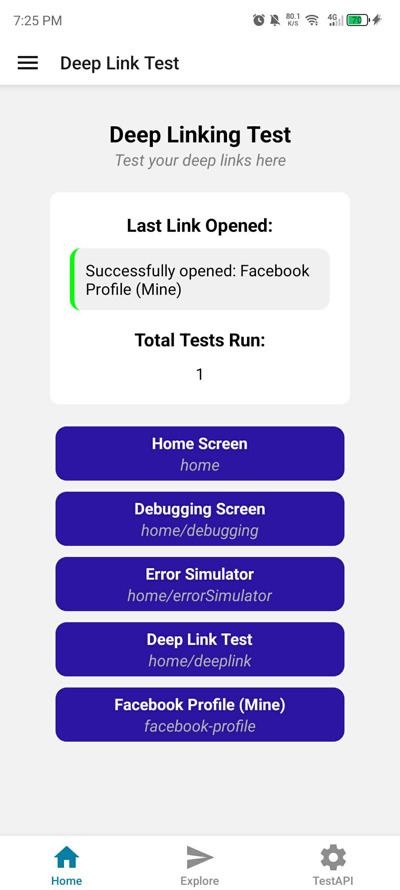
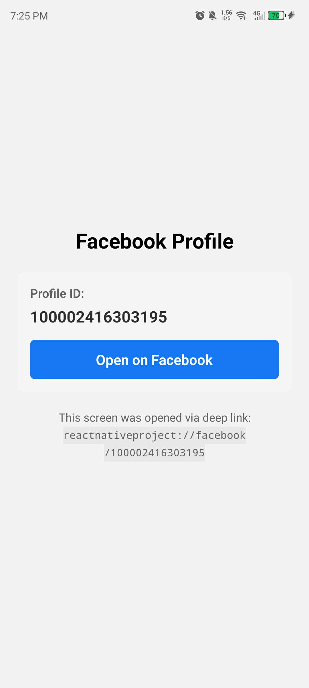
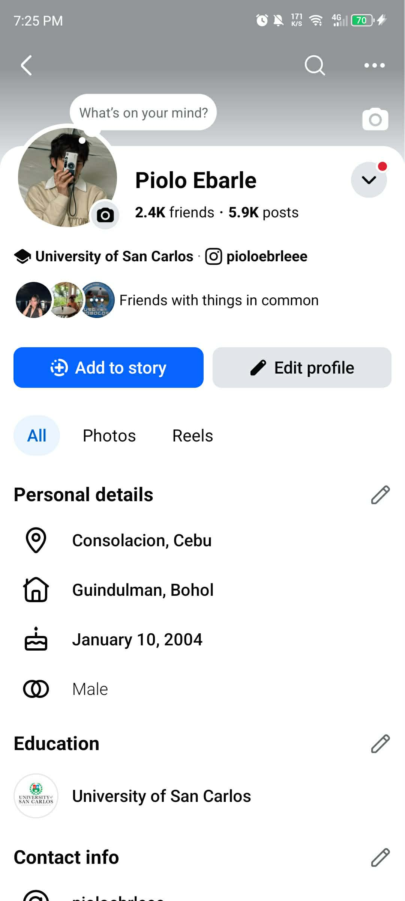

# Milestone 12: Focus on Bear-Specific Libraries

## Issue 19: Handling Deep Linking and Routing

Deep linking dramatically improves the user experience by reducing friction. It allows for seamless transitions from marketing emails, push notifications, or shared links directly to relevant content. For Focus Bear, it enables automated workflows where external triggers (like a calendar event) can launch specific focus routines.

It uses a `linking` prop on the `NavigationContainer`. This prop acts as a translator between a URL string and the app's internal navigation state. It can handle parsing parameters (like :`id`) and can even handle nested navigators by mapping the URL path through the navigation tree.

One major challenge is **Initial State**. If the app is closed and opened via a link, you have to ensure any required data (like user authentication) is loaded before the screen renders. Another challenge is Security: malicious links could try to trigger sensitive actions, so parameters must be validated. Finally, keeping the URL structure in sync between the website and the mobile app requires careful coordination.

## Code Snippet on Deep Linking

[DeepLinkTester.tsx](https://github.com/pioloebarle/pioloebarle-intern-repo/blob/main/milestones/8-React-Native-Fundamentals/react-native-project/components/DeepLinkTester.tsx)

[_layout.tsx](https://github.com/pioloebarle/pioloebarle-intern-repo/blob/main/milestones/8-React-Native-Fundamentals/react-native-project/app/_layout.tsx)

[_layout.tsx](https://github.com/pioloebarle/pioloebarle-intern-repo/blob/main/milestones/8-React-Native-Fundamentals/react-native-project/app/facebook-profile.tsx)

## Output for Deep Linking to my Facebook Profile

*from left to right*

1. You are on the deep link example page and clicking the Facebook Profile button.
2. You click the "Go to Facebook Profile" button, which opens the Facebook app 
3. You are taken directly to my Facebook profile page, even if the Facebook app was closed before clicking the link

  
  
  

