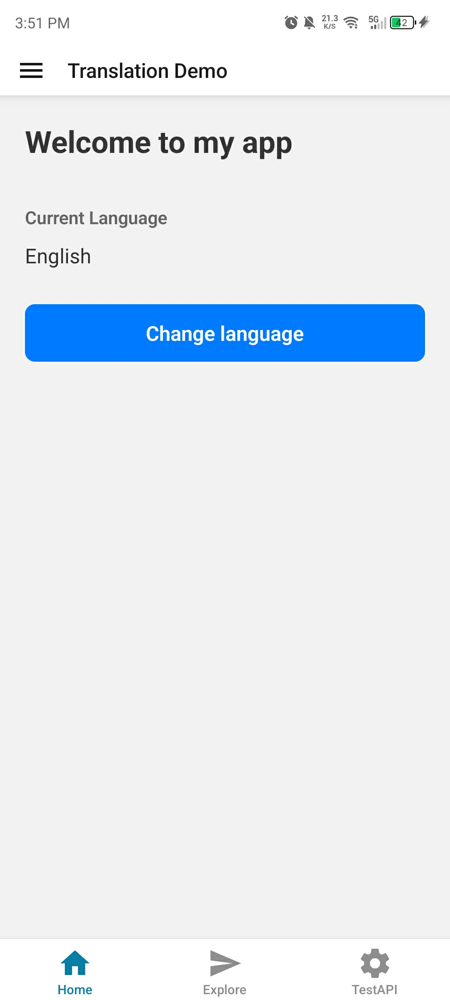
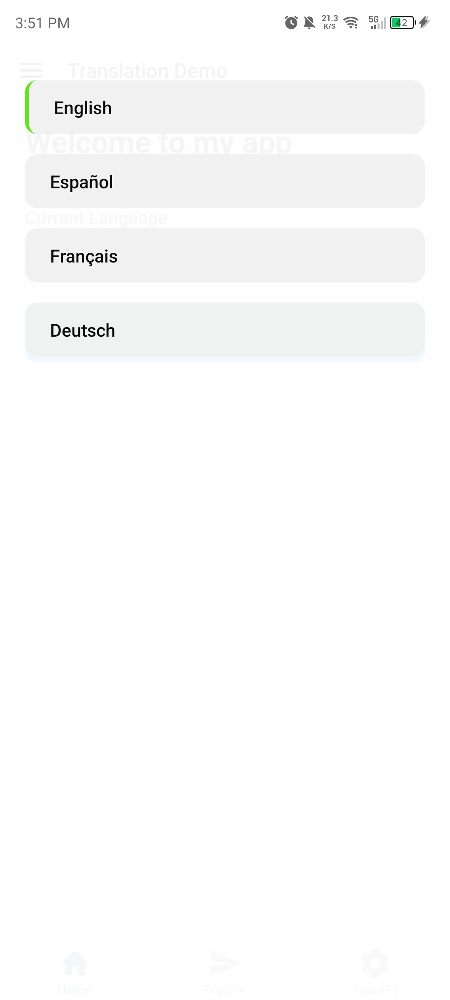
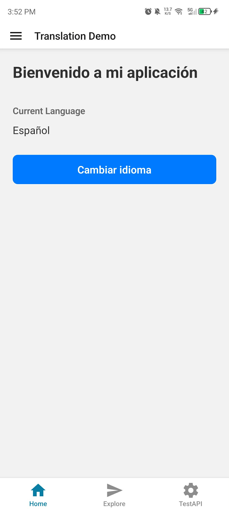
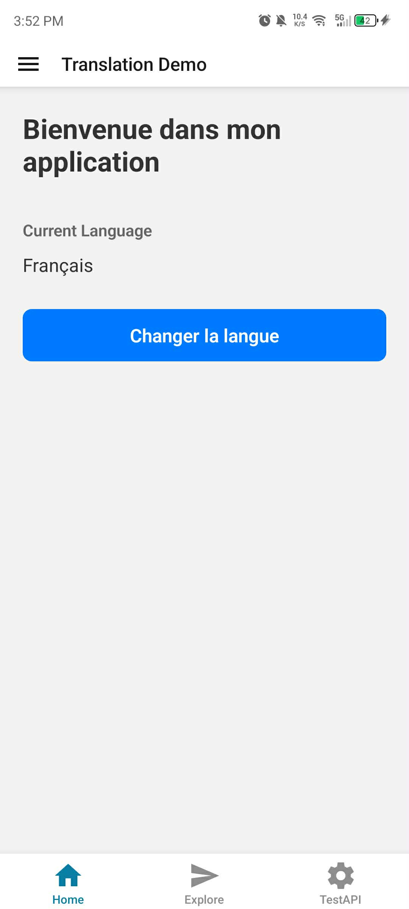
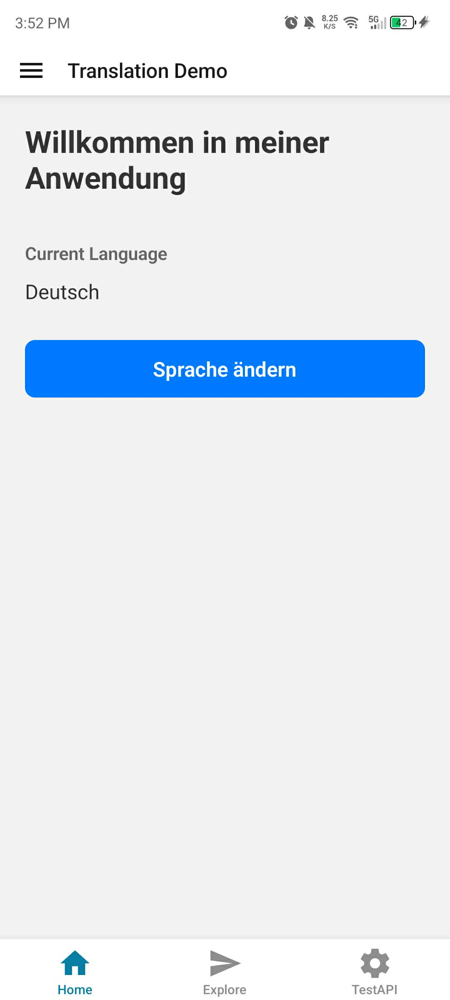

# Milestone 12: Focus on Bear-Specific Libraries

## Issue 20: Implementing Localisation (i18n) with react-i18next

`react-i18next` uses a provider pattern. Once configured, the `useTranslation` hook gives us access to a `t` function. When we call `t('key')`, the library checks the current active language, finds the corresponding JSON resource, and returns the translated string. It also handles advanced cases like **Pluralization** (one item vs. many) and **Interpolation** (inserting names into strings).

**Challenges when localising a React Native app:** 

* **Layout Overflow**: Some languages (like German) are much longer than English, which can break UI buttons or text containers.
* **Right-to-Left (RTL)**: Languages like Arabic require flipping the entire UI layout.
* **Non-String Content**: Localization isn't just text; it also includes dates, currency formats, and measurement units (Metric vs. Imperial), which require extra libraries like intl or luxon.

To test localisation support in an app, I would use **Pseudo-localization**, which replaces characters with weird versions (e.g., `Wéélcôméé`) to see if any hardcoded strings were missed. I would also use an emulator to switch system locales to verify that `react-native-localize` correctly detects the change and that the layout handles different text lengths gracefully.

## Code Snippet on Translation using react-i18next

[Translation.tsx](https://github.com/pioloebarle/pioloebarle-intern-repo/blob/main/milestones/8-React-Native-Fundamentals/react-native-project/components/Translation.tsx)

[i18next.ts](https://github.com/pioloebarle/pioloebarle-intern-repo/blob/main/milestones/8-React-Native-Fundamentals/react-native-project/services/i18next.ts)

## Output for Deep Linking to my Facebook Profile

*from left to right*

1. Translation Demo Page (English language default)
2. Languages options
3. Spanish Translation
4. French Translation
5. German Translation

  
  
  
  
  

