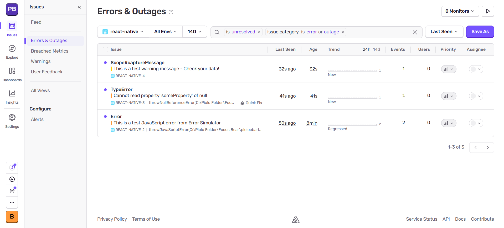
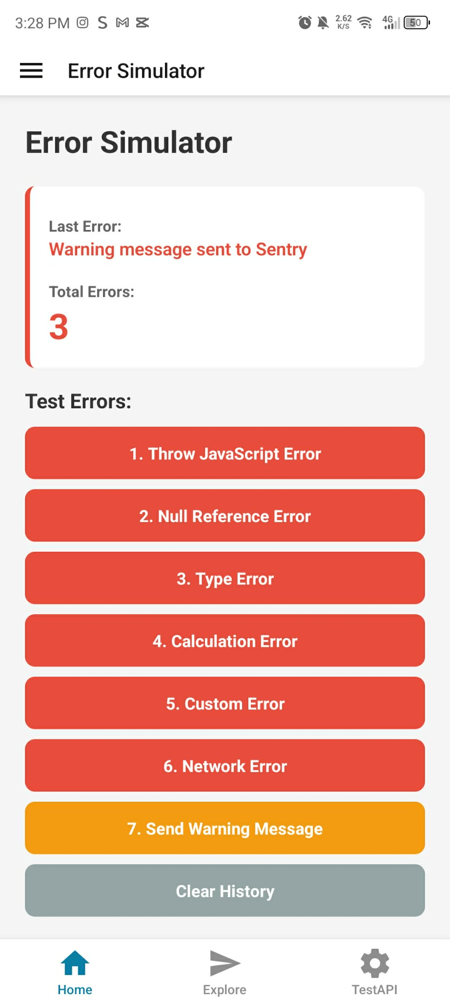

# Milestone 12: Focus Bear Specific Libraries

## Issue 18: Logging and Crash Reporting with Sentry

In a production, users are the "QA team". Without logging, a silent failure or crashes might never be reported. Logging provides the **observability** needed to understand how the app behaves in the real world across different devices, OS versions, and network conditions. It allows developers to capture critical information about errors, performance issues, and user interactions that can be used to diagnose and fix problems that occur in production.

Sentry turns "I think it crashed" into "It crashed at line 42 of AuthService.ts". It improves the traceability of errors by providing detailed stack traces, user context, and breadcrumbs leading up to the error. This allows developers to quickly identify the root cause of issues and fix them efficiently. Sentry also offers performance monitoring features that help identify bottlenecks and optimize the app's performance.

The best practices for handling and logging errors are:

* **Use Error Boundaries**: Wrap your UI components so a single small error doesn't turn the whole screen white.
* **Sanitize Data**: Never log PII(Personally Identifiable Information) like passwords or API keys to Sentry.
* **Level Appropriately**: Use `warning` for recoverable issues, `error` for crashes, and `info` for important events. This helps prioritize what to fix first.
* **Don't over log**: Logging every single button tap can make the "breadcrumbs" noisy and harder to read.

## Code Snippet on React Native Components

[sentrySetup.ts](https://github.com/pioloebarle/pioloebarle-intern-repo/blob/main/milestones/8-React-Native-Fundamentals/react-native-project/utils/sentrySetup.ts)

[ErrorSimulator.tsx](https://github.com/pioloebarle/pioloebarle-intern-repo/blob/main/milestones/8-React-Native-Fundamentals/react-native-project/components/ErrorSimulator.tsx)

[debugLogger.ts](https://github.com/pioloebarle/pioloebarle-intern-repo/blob/main/milestones/8-React-Native-Fundamentals/react-native-project/utils/debugLogger.ts)

### Output of using Sentry

**Sentry Dashboard**

**UI Output**

