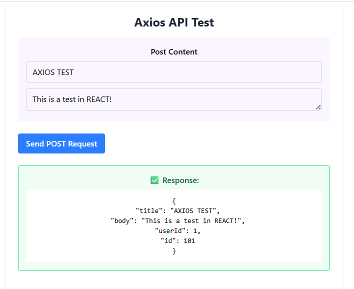

## Issue 73: Making API Calls with Axios

It centralizes configuration. Instead of typing the `baseURL`, `headers`, and `timeout` for every single API call, you define them once. This makes the code **DRY (Don't Repeat Yourself)**. If the API URL changes (from staging to production), you only have to update it in one file instead of searching through fifty components.

Interceptors act as a "Gatekeeper". They automatically inject the `Authorization` token into every outgoing request. This means you don't have to manually add the token to every single API call, which reduces the risk of forgetting to include it and getting unauthorized errors.

When a request times out, Axios throws an error that you can catch and handle gracefully. This allows you to show a user-friendly message or retry the request instead of leaving the user wondering why nothing happened. You should handle this in a `catch` block by notifying the user (a "Try Again" button) and ensuring the loading spinner is turned off so the app doesn't stay stuck in a loading state.

### Installation & Setup

In your terminal run this following command:

`npm install axios`

### Code Snippet for API Calls

[TestAPI.jsx](https://github.com/pioloebarle/pioloebarle-intern-repo/blob/main/milestones/5-React-Fundamentals/react-project/src/components/TestAPI.jsx)

### TestAPI.jsx Output

