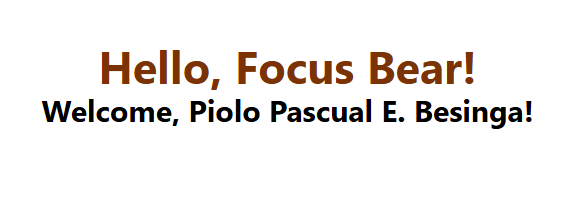
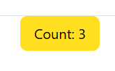

# Milestone 5: React Fundamentals

## Issue 59: Setting up a React Project

I did not face any challenges while setting up the React Project with TailWind CSS. I followed some tutorials on how to set up a React project with Tailwind CSS in YouTube. The video was very helpful and informative and I was able to set up the project without any issues. Another thing is I have experience in creating a React Project in my academic years so it helped me alot aside from the Youtube Tutorial.

**Youtube Video:**
[How to Create a React App with Tailwind CSS v4 | Full Project & Setup Tutorial (2025)](https://www.youtube.com/watch?v=8ffYlFxxBpc)

### Steps in Setting up React with TailWind CSS

* `npm create vite@latest`
  * Framework: React
  * Variant: JavaScript
* `npm run dev`
* `npm install tailwindcss @tailwindcss/vite`
  * for more details visit [TailWind CSS Documentation](https://tailwindcss.com/docs/installation/using-vite)

## Issue 60: Understanding Components & Props

Components are very important in React because they allow us to break down our UI into smaller, reusable pieces. This makes our code more organized and easier to maintain. Components also help us to manage the state of our application and to create dynamic user interfaces.

### Component Example



### Code Snippet for components with props

```Javascript
function HelloWorld({ name }) {
  return (
    <div>
      <h1 className="text-4xl font-bold text-amber-900">Hello, Focus Bear!</h1>
      <p className="text-2xl font-bold">Welcome, {name}!</p>
    </div>
  )
}
export default HelloWorld
```

## Issue 61: Handling State & User Input

If you modify state directly, React will not reflect the changes in the UI because it does not know that the state has changed. When you use the function like `setCount`, React is able to track the changes, re-render the component and update the changes in the UI accordingly. If you bypass this by changing the variable manually, the data changes in the background but the user still see the old value on the screen.

### useState Example



### Code Snippet for component with useState

```Javascript
import { useState } from "react"
function Counter() {
  const [count, setCount] = useState(0)
  return (
    <div>
        <button onClick={() => setCount(count + 1)}
            className="px-4 py-2 bg-yellow-200 text-black rounded-lg hover:bg-yellow-300">
            Count: {count}
        </button>
    </div>
  )
}

export default Counter
```

## Issue 62: Working with Lists & User Input

The common issues with Lists in React are:

1. **Key Prop**: When rendering lists, React requires a unique `key` prop for each item. If you forget to provide a key or use an index as a key, it can lead to performance issues and bugs when the list changes.

2. **Mutating State Directly**: React expects state to be immutable. If you directly mutate an array or object in state, React won't detect the change and won't re-render the component. Always use methods like `setState` or `useState` to update state immutably.

3. **Unexpected "Stale" State Issues**: When mapping through a list to create buttons, the closure inside the `.map()` function might capture an old version of the state if not handled correctly. To fix this, you can use a functional update to ensure you're working with the latest state such as `setList(prevList => ...)`.

### List Example


### Code Snippet for list

```Javascript
import './App.css'
import Counter from './Counter'
import HelloWorld from './HelloWorld'
import { useState } from 'react'
function App() {
  const [inputValue, setInputValue] = useState("")
  const [items, setItems] = useState([])
  const handleAddItem = () => {
    if (inputValue.trim() !== "") {
      setItems([...items, inputValue])
      setInputValue("")
    }
  }
  return (
    <>
      <HelloWorld name = "Piolo Pascual E. Besinga" ></HelloWorld>
      <Counter></Counter>
      <div className='px-5 py-5 flex flex-col gap-4 items-center'>
        <h1 className='text-2xl font-bold'>My list</h1>
        <input type="text" className='w-1/2 border-2 px-1 py-1 rounded-lg' value={inputValue} onChange={(e) => setInputValue(e.target.value)}/>
      
        <button className='border-2 px-2 py-0.5 rounded-lg' onClick={handleAddItem}>Add Item</button>
      </div>

      {items.length > 0 && (
        <div className='mt-4'>
          <h2 className='text-xl font-bold'>Items:</h2>
          <ul className='list-disc pl-5'>
            {items.map((item, index) => (
              <li key={index}>{item}</li>
            ))}
          </ul>
        </div>
      )}

    </>
  )
}

export default App
```

## Issue 65: Navigation with React Router

Client-side routing (CSR) allows a web application to update the URL and render different components without refreshing the entire page. The main advantages are:

1. **Faster Navigation**: Since the page doesn't need to reload, navigation feels much faster and smoother.

2. **Reduced Server Load**: The server only sends the initial "shell" and subsequent data (via APIs), rather than re-rendering and sending full HTML pages for every click.

3. **Better User Experience**: CSR allows for more dynamic and interactive user interfaces, as components can update in real-time without waiting for server responses.

### Installation & Setup

In your terminal run this following command:

`npm install react-router-dom`

### Code Snippet for Navigation

[Home.jsx](https://github.com/pioloebarle/pioloebarle-intern-repo/blob/main/milestones/5-React-Fundamentals/react-project/src/pages/Home.jsx)

[Profile.jsx](https://github.com/pioloebarle/pioloebarle-intern-repo/blob/main/milestones/5-React-Fundamentals/react-project/src/pages/Profile.jsx)

[App.jsx](https://github.com/pioloebarle/pioloebarle-intern-repo/blob/main/milestones/5-React-Fundamentals/react-project/src/App.jsx)

### Home.jsx Output


### Profile.jsx Output


