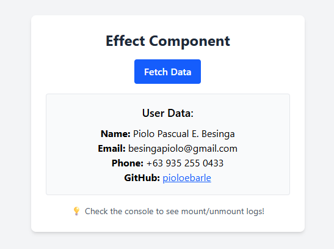
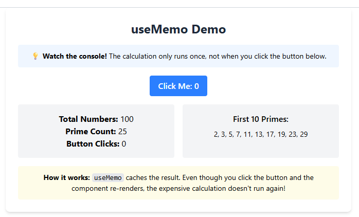
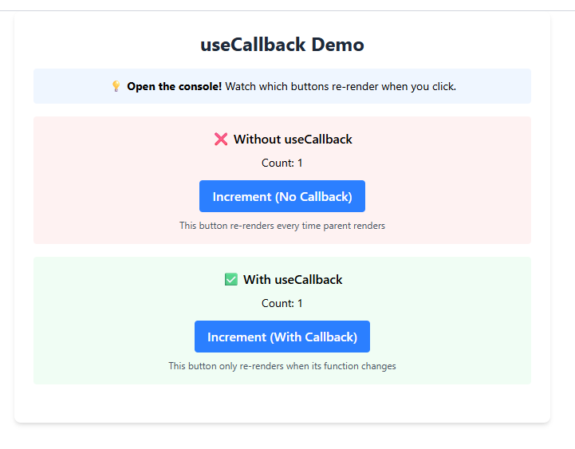

## Issue 66: Understanding React Hooks: `useEffect`

Use `useEffect` for **side effects** that should happen automatically in response to changes in state or props. On the other hand, use event handlers for **user interactions** that should happen in response to user actions, such as clicks or form submissions. If the logic must happen because the user clicked, use an event handler. If it must happen because the component is visible, use `useEffect`.

If you omit the dependency array entirely, the useEffect will run **after every single render**. This is rarely what you want, as it can lead to massive performance drops or infinite loops if you are updating state inside that same effect.

Improper use of `useEffect` can lead to issues such as:

1. **Infinite Loops**: If you update state inside a `useEffect` without a proper dependency array, it can cause the effect to run indefinitely.

2. **Memory Leaks**: If you set up subscriptions or timers in `useEffect` and forget to clean them up, it can lead to memory leaks.

3. **Unnecessary Re-renders**: Including large objects or arrays in the dependency array without memoization (`useMemo`), causing the effect to fire on every render because the object's memory reference changed.

### Code Snippet for useEffect

[EffectComponent.jsx](https://github.com/pioloebarle/pioloebarle-intern-repo/blob/main/milestones/5-React-Fundamentals/react-project/src/components/EffectComponent.jsx)

### EffectComponent.jsx Output:

## Issue 67: Optimizing Performance with `useMemo`

`useMemo` improves performance by **memoizing** (caching) the result of a calculation. In React, every time a state changes, the entire component re-renders. If you have a heavy loop or complex data transformation, it can cause performance issues. By using `useMemo`, you can ensure that the expensive calculation only runs when its dependencies change, rather than on every render.

You should avoid it for **cheap calculations** (like simple string concatenation or basic math). Memoization itself has a "cost", React has to store the value in memory and run a comparison check on the dependencies every render. If the calculation is faster than the overhead of `useMemo`, using it actually makes your app slightly slower and uses more memory.

If you remove it, the "expensive" calculation will run on **every single render**. In the example above, typing even one letter into the text input would trigger a re-render, which would force the for loop to run 1 billion times again. This would cause the UI to feel "laggy" or completely frozen while typing, even though the typing has nothing to do with the numbers being summed.

### Code Snippet for useMemo

[MemoComponent.jsx](https://github.com/pioloebarle/pioloebarle-intern-repo/blob/main/milestones/5-React-Fundamentals/react-project/src/components/MemoComponent.jsx)

### MemoComponent.jsx Output:

## Issue 68: Preventing Unnecessary Renders with `useCallback`

`useCallback` solves the issue of **Referential Equality**. In JavaScript, every time a function is defined, it gets a new spot in memory. Even if the code inside is identical, `functionA === functionB` is `false`. In React, when a Parent re-renders, it re-creates all its functions. If those functions are passed as props to a Child, the Child thinks it received "new" data and re-renders unnecessarily. `useCallback` keeps the function's memory address the same between renders.

`useMemo` calls a function and caches the result. On the other hand, `useCallback` caches the function itself without calling it.
* `useMemo(() => fn())` returns the return value of `fn`.
* `useCallback(() => fn)` returns the function `fn` itself.

It is not useful if the component receiving the function is not wrapped in `React.memo`. If the Child re-renders every time the Parent does anyway, then `useCallback` is just adding extra work for React to track dependencies for no benefit. It’s also overkill for simple components where re-renders are extremely cheap and fast.

### Code Snippet for useCallback

[CallbackComponent.jsx](https://github.com/pioloebarle/pioloebarle-intern-repo/blob/main/milestones/5-React-Fundamentals/react-project/src/components/CallbackComponent.jsx)

### CallbackComponent.jsx Output:

