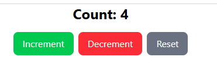

# Milestone 7: Redux

## Issue 63: Introduction to Redux Toolkit 

Use `useState` for state that is **local** to a single component and doesn't need to be shared. One example is "show more" toggle or a temporary form input.

Use **Redux** when:
1. **State is shared**: Multiple components across different levels of the component tree need access to the same state. For example, theme settings or User Profile data needed in both the Navbar and the User Dashboard.
2. **Complex state logic**: When the state management involves complex logic, such as deeply nested updates or when the next state depends on the previous state. Redux's immutability and pure functions can help manage this complexity.
3. **Persistence**: You want a predictable way to track state changes over time or easily sync state with `localStorage`.
4. **Prop Drilling is becoming messy**: You are passing a piece of state through 5+ layers of components just to get it where it needs to go.

### Installation and Setup

In your terminal run this following command:

`npm install @reduxjs/toolkit react-redux`

### Code Snippet in using Redux in React

### Counter.jsx Output:
