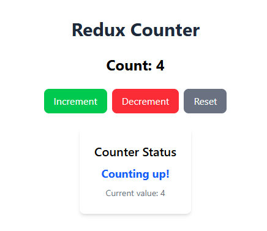

# Milestone 7: Redux

## Issue 63: Introduction to Redux Toolkit 

Use `useState` for state that is **local** to a single component and doesn't need to be shared. One example is "show more" toggle or a temporary form input.

Use **Redux** when:
1. **State is shared**: Multiple components across different levels of the component tree need access to the same state. For example, theme settings or User Profile data needed in both the Navbar and the User Dashboard.
2. **Complex state logic**: When the state management involves complex logic, such as deeply nested updates or when the next state depends on the previous state. Redux's immutability and pure functions can help manage this complexity.
3. **Persistence**: You want a predictable way to track state changes over time or easily sync state with `localStorage`.
4. **Prop Drilling is becoming messy**: You are passing a piece of state through 5+ layers of components just to get it where it needs to go.

### Installation and Setup

In your terminal run this following command:

`npm install @reduxjs/toolkit react-redux`

### Code Snippet in using Redux in React

[Counter.jsx](https://github.com/pioloebarle/pioloebarle-intern-repo/blob/main/milestones/5-React-Fundamentals/react-project/src/components/Counter.jsx)

[CounterSlice.jsx](https://github.com/pioloebarle/pioloebarle-intern-repo/blob/main/milestones/5-React-Fundamentals/react-project/src/redux/slices/CounterSlice.jsx)

[Store.jsx](https://github.com/pioloebarle/pioloebarle-intern-repo/blob/main/milestones/5-React-Fundamentals/react-project/src/redux/Store.jsx)

### Counter.jsx Output:

## Issue 64: Using Selectors in Redux Toolkit 

These are the benefits of using selectors in Redux Toolkit:

1. **Encapsulation**: Selectors encapsulate the logic for accessing specific parts of the state, making it easier to manage and maintain. This means that if the structure of the state changes, you only need to update the selector rather than every component that accesses that part of the state.
2. **Derived Data**: Selectors can transform or compute data from the state. This keeps the component logic simple and focused on rendering, while the selector handles any necessary data manipulation.
3. **Performance Optimization**: When using libraries like Reselect, selectors can be memoized, which means they will only recompute when their input state changes. This can improve performance by preventing unnecessary re-renders of components that rely on the selector's output.
4. **Reusability**: Selectors can be reused across different components, promoting code reuse and consistency in how state is accessed throughout the application.

### Code Snippet in using Selectors in Redux Toolkit

[Counter.jsx](https://github.com/pioloebarle/pioloebarle-intern-repo/blob/main/milestones/5-React-Fundamentals/react-project/src/components/Counter.jsx)

[CounterDisplay.jsx](https://github.com/pioloebarle/pioloebarle-intern-repo/blob/main/milestones/5-React-Fundamentals/react-project/src/components/CounterDisplay.jsx)

[CounterSlice.jsx](https://github.com/pioloebarle/pioloebarle-intern-repo/blob/main/milestones/5-React-Fundamentals/react-project/src/redux/slices/CounterSlice.jsx)

### Counter.jsx Output:
