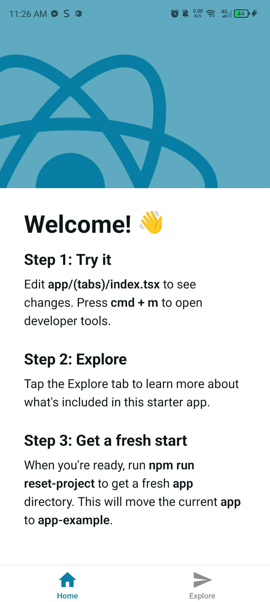

# Milestone 8: React Native Fundamentals

## Issue 30: Setting up a React Native Development Environment (Expo & Metro Server)

Metro is the **JavaScipt Bundler** for React Native. Its job is to take all your individual `.js` or `.tsx` files and bundle them together into a single file that can be executed by the JavaScript engine on the device. It also handles features like hot reloading, which allows you to see changes in your code immediately without needing to restart the app.

Expo acts as a **managed layer** on top of React Native. It provides a pre-configured environment, so you don't have to touch complex native code (Java/Swift) in the beginning. It also includes the **Expo Go** app, which lets you run your code on a physical phone without needing to set up heavy SDKs like Android Studio or Xcode immediately.

In setting up my React Native environment, I didnt experienced any issues. I just followed the instructions on the official Expo documentation and it was pretty straightforward. On the other hand, I also watched a YouTube video Course for Beginners and it was also very helpful in understanding the basics of React Native and how to set up the environment.

YT Link: [React Native Course for Beginners in 2025 | Build a Full Stack React Native App](https://www.youtube.com/watch?v=f8Z9JyB2EIE)

### Setting up the Environment

In your terminal run this following command:

`npx create-expo-app@latest <project-name>`

`cd <project-name>`

`npx expo start`

Download the Expo Go app on your phone and scan the QR code to run the app on your device. And then you can start editing the `index.tsx` file to see your changes in real-time on your phone.

### Output:
