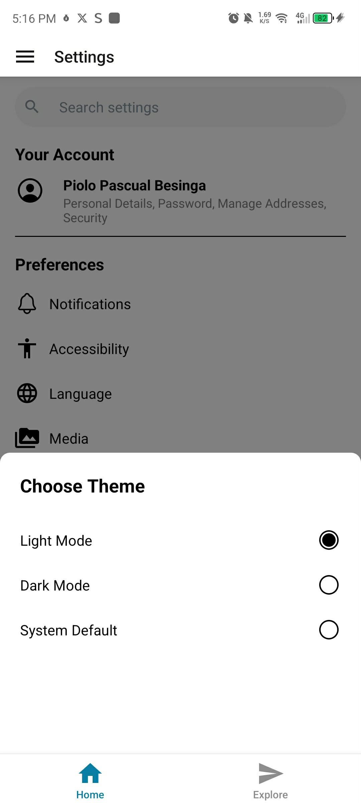

# Milestone 8: React Native Fundamentals

## Issue 26: Handling Gestures and Animations in React Native

The built-in `Animated` API is great for simple transitions but often still relies on communication between the JavaScript and Native threads. `react-native-reanimated` (Version 2/3) allows us to write "Worklets", JavaScript code that runs directly on the UI thread. This ensures animations stay at 60 FPS even if the JavaScript thread is totally "locked up" by heavy data processing.

In standard React Native, touch events are sent across the "bridge" to JavaScript. If the JS thread is busy, your swipe will feel delayed. `react-native-gesture-handler` handles the touch detection on the Native side (Java/Objective-C). It only tells JavaScript when a gesture has officially succeeded, making the interaction feel instant and responsive.

Gestures are best for **contextual actions** that feel natural to a thumb, like swiping a card to dismiss it or pinching a photo to zoom. They save screen real estate and make the app feel "premium." However, you should still provide buttons for critical actions (like "Delete") to ensure accessibility for users who may have motor-function difficulties.

React Native is single-threaded for JavaScript. If you start a heavy API call or a massive Redux state update while a screen transition is happening, the animation will "drop frames" and stutter. `runAfterInteractions` allows you to queue that heavy work to start only after the user-facing animations are finished, keeping the UI silky smooth.

### Code Snippet on React Native Components

[settings.tsx](https://github.com/pioloebarle/pioloebarle-intern-repo/blob/main/milestones/8-React-Native-Fundamentals/react-native-project/app/(tabs)/home/settings.tsx)

### Output of Navigation:

