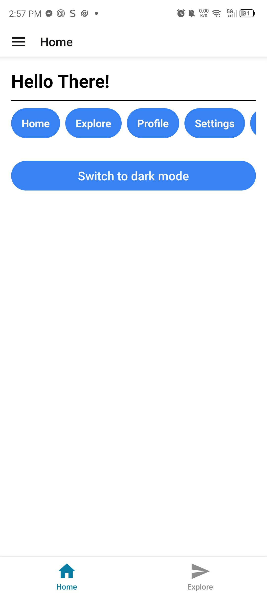
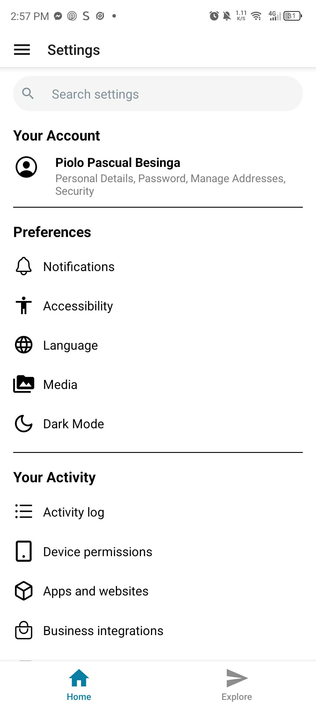
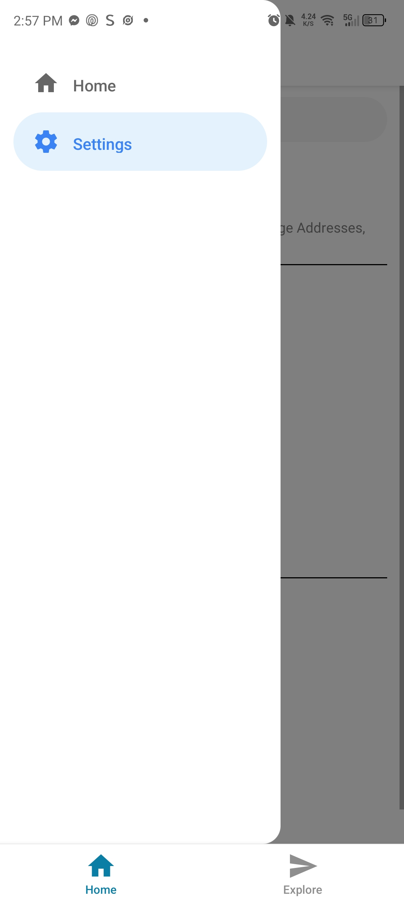

# Milestone 8: React Native Fundamentals

## Issue 27: Navigation in React Native using React Navigation

The difference between stack, tab and drawer navigators are:

* **Stack**: This is for a linear "flow" of screens, where you can push and pop screens on top of each other. Example is clicking an item to see its details, then going back to the list.
* **Tab**: This is for top-level app sections that stays accessible at all times. Example is a bottom tab bar with "Home", "Search", and "Profile" tabs.
* **Drawer**: This is for a side menu that can be pulled out from the edge of the screen, often used for navigation in larger apps. Example is a hamburger menu that opens a drawer with navigation links.

It uses native-driven animations to slide or fade screens. On iOS, stacks usually slide from the right, while on Android, they often fade or slide upward. Because it uses `react-native-screens`, these transitions are offloaded to the native UI thread, keeping them smooth at 60 FPS.

Deep linking allows a URL to open a specific screen in the app. For example, `myapp://profile/123` could open the profile screen for user ID 123. To implement this:
1. Define a prefix
2. Create a linking configuration that maps URL paths to screens
3. Pass the linking configuration to the `NavigationContainer`
4. Configure the native `AndroidManifest.xml` (Android) and `Info.plist` (iOS) to handle the URL scheme

### Code Snippet on React Native Components

[index.tsx](https://github.com/pioloebarle/pioloebarle-intern-repo/blob/main/milestones/8-React-Native-Fundamentals/react-native-project/app/(tabs)/home/index.tsx)

[settings.tsx](https://github.com/pioloebarle/pioloebarle-intern-repo/blob/main/milestones/8-React-Native-Fundamentals/react-native-project/app/(tabs)/home/settings.tsx)

[_layout.tsx](https://github.com/pioloebarle/pioloebarle-intern-repo/blob/main/milestones/8-React-Native-Fundamentals/react-native-project/app/(tabs)/home/_layout.tsx)

### Output of Navigation:

  
  
  

