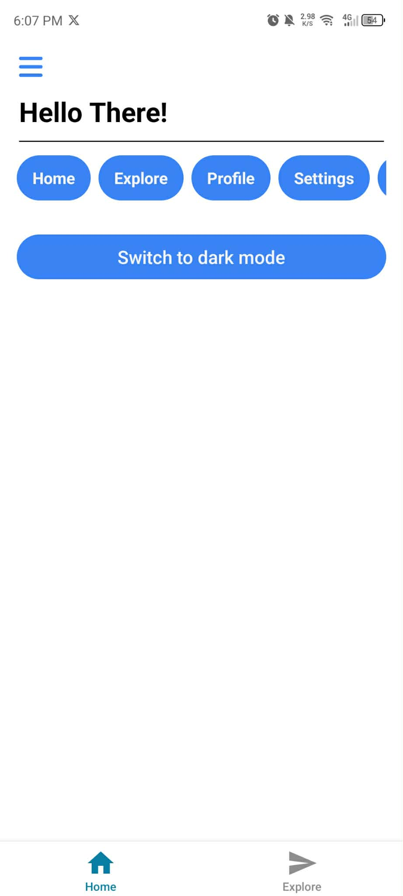
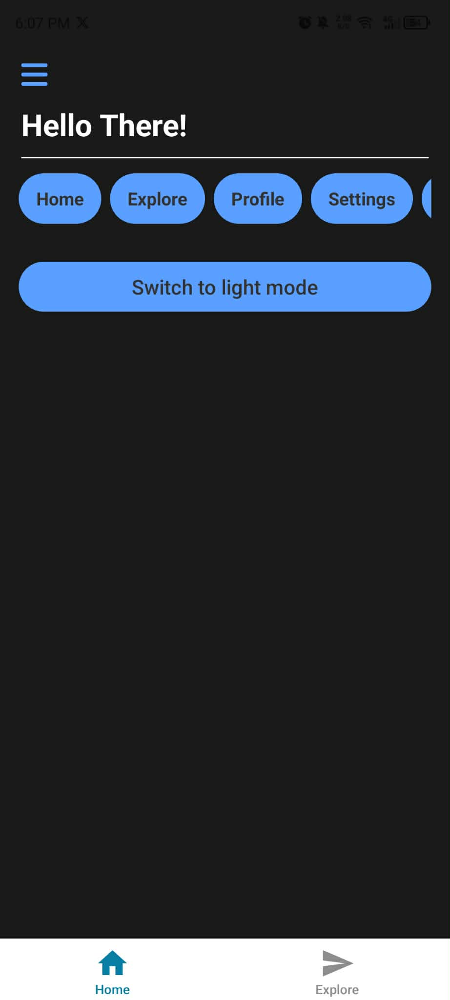

# Milestone 8: React Native Fundamentals

## Issue 28: React Native Stylesheets vs CSS-in-JS

React Native use `camelCase` since React Native styles are actually **JavaScript Objects**, a hyphen (-) is a subtraction operator. If you tried to write `background-color: "white"`, JS would try to subtract `color` from `background`, which causes a syntax error. Using `camelCase` allows the styles to be valid keys in a standard JS object,

The benefits of using `Stylesheet.create()` over inline styles are:

1. **Performance**: Styles defined with `StyleSheet.create()` are only sent over the React Native bridge once, and then referenced by ID, which can improve performance. Inline styles create a new object on every render, which can lead to increased memory usage and slower performance.

2. **Organization**: It keeps the component logic (JSX) separate from the visual design, making the code easier to read and maintain.

3. **Validation**: `StyleSheet.create()` provides validation and warnings for invalid style properties, which can help catch errors early in development.

Instead of using fixed pixel values, I would use a combination of:

* **Flexbox**: To allow elements to grow and shrink proportionally.
* **Percentage-based dimensions**: To make elements scale relative to their parent container.
* **useWindowDimensions**: To write conditional logic for "breakpoints" based on the device's screen size.
* **Platform-Specific Styles**: Using Platform.select() if a design needs to look significantly different on different platforms.

### Code Snippet on React Native Components

[index.tsx](https://github.com/pioloebarle/pioloebarle-intern-repo/blob/main/milestones/8-React-Native-Fundamentals/react-native-project/app/(tabs)/index.tsx)

### Output of Light and Dark Modes

  
  

